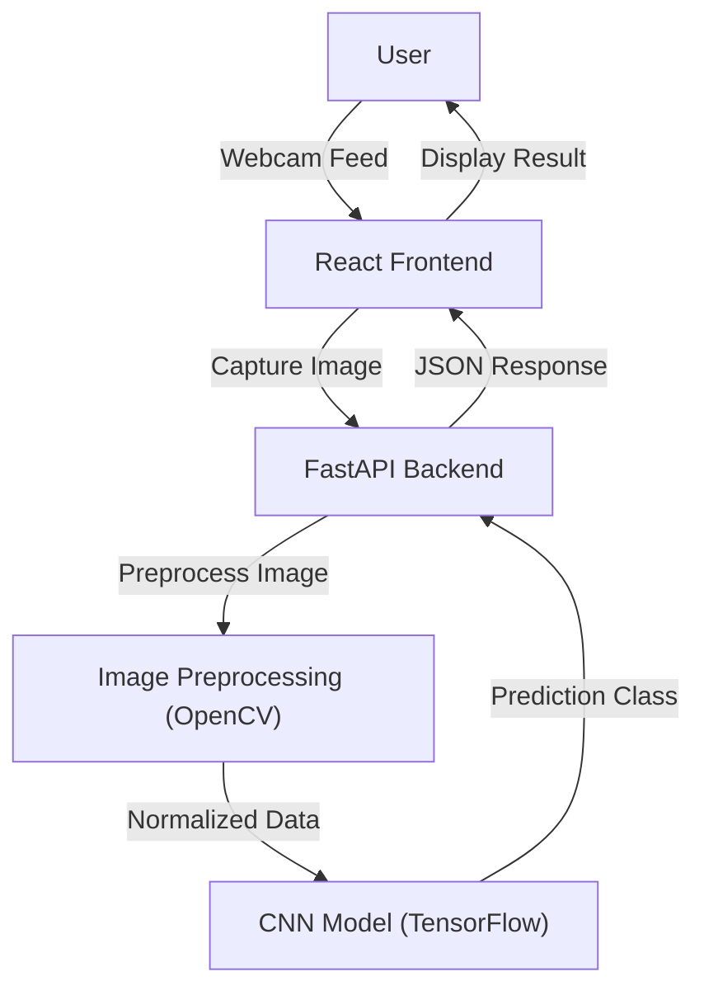

# Real-Time Gesture-Based Sign Language to Speech Translator


A powerful, real-time sign language detection system that translates hand gestures into text and speech using a Convolutional Neural Network (CNN) and a modern React frontend.

## 🌟 Features

*   **Real-Time Detection**: Instantly translates sign language gestures captured via webcam.
*   **High Accuracy**: Powered by a custom-trained CNN model (`sign_trained_cnn.h5`).
*   **Modern UI**: A premium, glassmorphism-styled frontend built with React and Tailwind CSS v4.
*   **Speech Integration**: (Planned/In-Progress) Text-to-speech capabilities for translated signs.
*   **Responsive Design**: Works seamlessly across desktop and mobile devices.

## 🛠️ Tech Stack

### Backend
*   **Python 3.8+**: Core language.
*   **FastAPI**: High-performance web framework for the API.
*   **TensorFlow/Keras**: Deep learning framework for the CNN model.
*   **OpenCV**: Image processing and computer vision.
*   **Uvicorn**: ASGI server.

### Frontend
*   **React**: Javascript library for building user interfaces.
*   **Vite**: Next-generation frontend tooling.
*   **Tailwind CSS v4**: Utility-first CSS framework for styling.
*   **Axios**: Promise-based HTTP client for the browser.

## 🏗️ Architecture



## 🚀 Installation

### Prerequisites
*   Python 3.8 or higher
*   Node.js (v16+) and npm
*   Git

### 1. Clone the Repository
```bash
git clone https://github.com/Abdullasaqib/REAL---TIME-GESTURE--BASED-SIGN-LANGUAGE-TO-SPEECH-TRANSLATOR.git
cd REAL---TIME-GESTURE--BASED-SIGN-LANGUAGE-TO-SPEECH-TRANSLATOR
```

### 2. Backend Setup
Create a virtual environment and install dependencies:

```bash
# Create virtual environment
python -m venv venv

# Activate virtual environment
# Windows:
.\venv\Scripts\activate
# Mac/Linux:
source venv/bin/activate

# Install dependencies
pip install -r requirements.txt
```

### 3. Frontend Setup
Navigate to the frontend directory and install dependencies:

```bash
cd frontpart/frontend
npm install
```

## 🏃‍♂️ Running the Application

### 1. Start the Backend Server
From the root directory (ensure your virtual environment is activated):

```bash
uvicorn apps:app --reload
```
The API will start at `http://127.0.0.1:8000`.

### 2. Start the Frontend Application
Open a new terminal, navigate to the frontend directory, and start the development server:

```bash
cd frontpart/frontend
npm run dev
```
The application will be accessible at `http://localhost:5173`.

## 📖 Usage

1.  Open your browser and navigate to `http://localhost:5173`.
2.  Click on **"Get Started"** or navigate to the **"Sign Detection"** page.
3.  Allow camera access when prompted.
4.  Position your hand in the frame and make a sign language gesture (A-Z).
5.  Click **"Capture"** to take a snapshot.
6.  Click **"Translate"** to verify the gesture. The predicted letter will appear on the screen.

## 📂 Project Structure

```
├── apps.py                 # FastAPI application entry point
├── requirements.txt        # Python dependencies
├── sign_trained_cnn.h5     # Pre-trained CNN model
├── train_model.py          # Script for training the model
├── utils.py                # Shared utility functions (preprocessing)
└── frontpart/
    └── frontend/           # React frontend application
        ├── src/
        │   ├── components/ # Reusable UI components (Header, etc.)
        │   ├── pages/      # Application pages (Home, webcam, etc.)
        │   ├── services/   # API integration (api.js)
        │   └── index.css   # Global styles (Tailwind)
        ├── package.json    # Frontend dependencies
        └── vite.config.js  # Vite configuration
```

## 🤝 Contributing

Contributions are welcome! Please fork this repository and submit a pull request for any features, bug fixes, or enhancements.

## 📄 License

This project is licensed under the MIT License.
